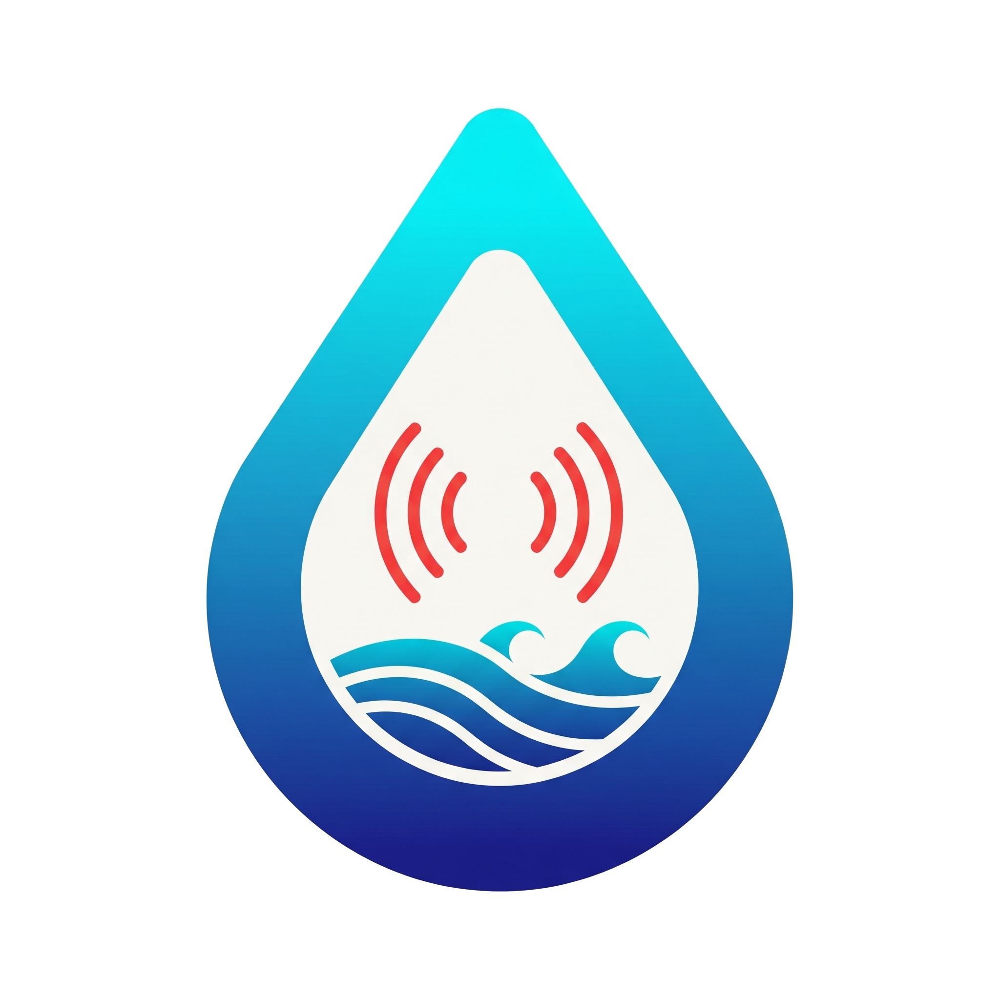

<div align="center">
  
  <h1>StreamDrop</h1>
  <h3>Stream any website, PyGame, or local HTML file to YouTube 24/7 on a $4/mo Droplet</h2>
  
  
  
  

</div>

**1. Quick Start:**
```bash
git clone https://github.com/Cfomodz/StreamDrop.git
cd StreamDrop
chmod +x setup.sh && ./setup.sh
```

**2. Open the web interface:**
```bash
http://your-server-ip:5000
```

**3. Add your first stream:**
- Get your YouTube Stream Key from [YouTube Studio](https://studio.youtube.com)
- Click "Add Stream" in the web interface
- Enter your stream key and content URL
- Click "Start Stream"

<div align="center">
  <h2>That's it. You're live!</h2>
  <a href="https://www.digitalocean.com/?refcode=30f96ca8496e&utm_campaign=Referral_Invite&utm_medium=Referral_Program&utm_source=badge"></a>
  <p>$200 Credit Referral Link | Pays for our droplets :)</p>
  <h4>Demo:</h4>
  
</div>

---

### Stream Management

**All streams are managed via the web interface:**
- Each stream has its own YouTube key and content path
- Streams run independently and restart if they fail


### Optimization

Auto-detects most efficient setup method (headless/X11). Perfect for cheap VPS ($4-6/mo)

### "Roadmap"

If someone would like to fork this and PR some alternative deployment options instead of just Ubuntu Server and Ubuntu Desktop (or go beyond apt based, or even unix based), I am open to that. If you do, please consider make it autodetecting or at least parameterized.


*Questions? The code is self-documenting.*

---

### Made with <3 by the FOSS community. 100% Funded by devs like you.
